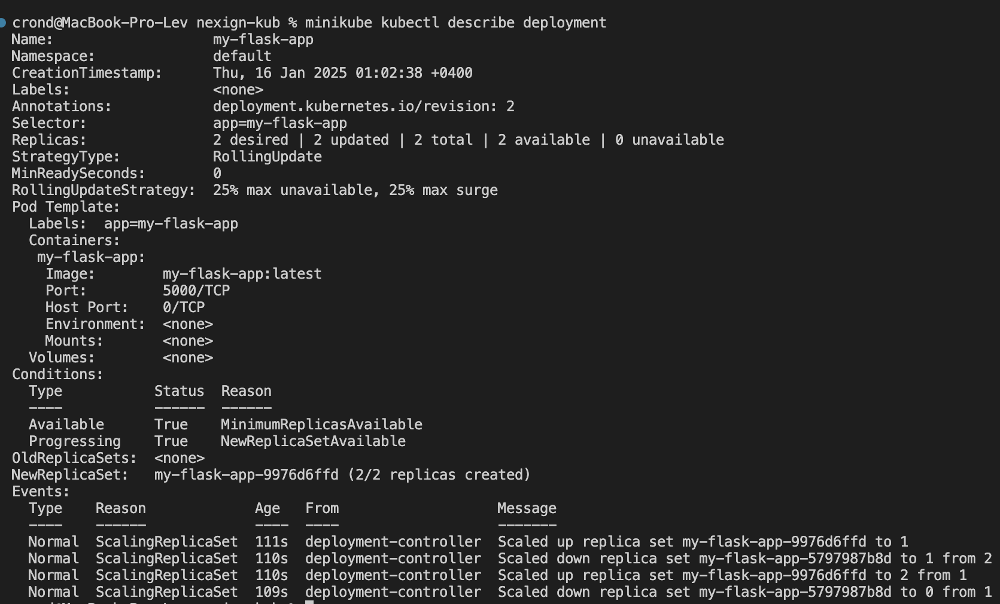
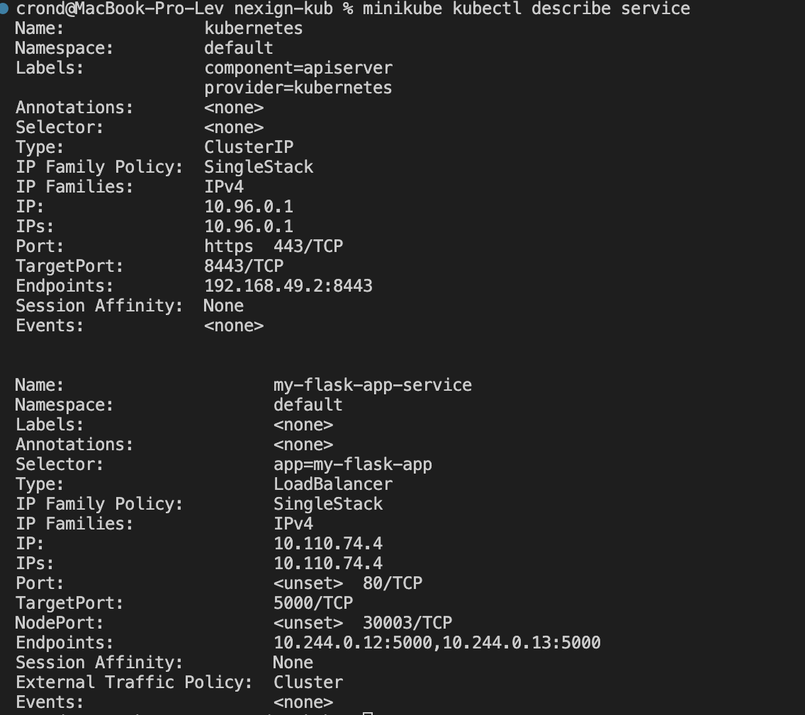
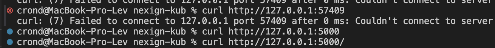

# nexign-ops
minikube уже был просто обновил его и сделал 

```
minikube stop 
minikube start --embed-certs --network bridge
```

Написал манифесты и собрал образ

Чтобы образ появился в миникубе добавим env

eval $(minikube docker-env)

docker buildx build -t my-flask-app:0.0.1 . (да версия не конкретная)

```
kubectl apply -f deployment.yaml
kubectl apply -f service.yaml
```
<details>
<summary>kubectl describe deployment</summary>



</details>


<details>
<summary>kubectl describe service</summary>



</details>

<details>
<summary>curl</summary>



</details>